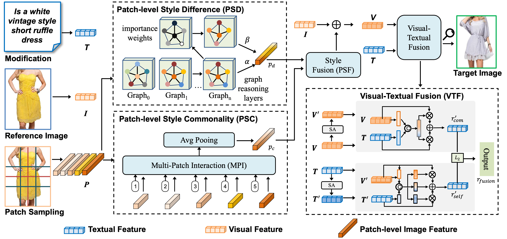

# **SPIRIT: Style-guided Patch InteRaction for fashion Image retrieval with Text feedback**

This is the source code of our TOMM 2024 paper "[SPIRIT: Style-guided Patch Interaction for Fashion Image Retrieval with Text Feedback](http://39.108.48.32/mipl/download_paper.php?fileId=202402)".



- [**SPIRIT: Style-guided Patch InteRaction for fashion Image retrieval with Text feedback**](#spirit-style-guided-patch-interaction-for-fashion-image-retrieval-with-text-feedback)
  - [Installation](#installation)
  - [Datasets](#datasets)
  - [Quick Start](#quick-start)
  - [Citation](#citation)
  - [Contact](#contact)
  - [Acknowledgements](#acknowledgements)

## Installation

```bash
conda env create -f environment.yml
source activate Fashion
```

## Datasets

Our model is evaluated on *FashionIQ*, *Shoes*, *Fashion200k* and *CIRR* datasets.

The download homepages for these datasets are listed as follows.

- [FashionIQ](https://github.com/XiaoxiaoGuo/fashion-iq)
- [Shoes](https://vision.cs.utexas.edu/whittlesearch/)
- [Fashion200k](https://github.com/xthan/fashion-200k)
- [CIRR](https://github.com/Cuberick-Orion/CIRR)

## Quick Start

- **dataloader**: Contains loading files for 4 commonly used datasets.
- **losses**: The ```loss.py``` file contains common loss functions, with BatchBasedClassificationLoss being the function actually used in the paper.
- **models**: Contains all modules that make up the ```SPIRIT``` model.
- **run**: Includes the entry files for training and testing on four datasets.
- **utils**: Comprises of utility functions that support various tasks within the project.

The training code is built on PyTorch with DistributedDataParallel (DDP). We pretrain the framework with 8 V100 GPUs.

FashionIQ, Shoes, and CIRR datasets can output metrics during training, whereas the Fashion200k dataset, due to its larger scale, requires training to be completed before testing.

Checkpoints download link: [Google Dive](https://drive.google.com/file/d/1EuNblNeQtAOgSkB9uKnBWzL5yeUtN_9U/view?usp=sharing)

```python
# FashionIQ
python -u -m torch.distributed.launch --nproc_per_node=8 --master_addr="127.0.0.1" --master_port=22223 run/train_fiq.py --dataset=fashionIQ --lr=4e-5 --batch-size=1024 --num-epochs=300 --clip-model-name="RN50x4" --save-training 

# Shoes
python -u -m torch.distributed.launch --nproc_per_node=8 --master_addr="127.0.0.1" --master_port=22223 run/train_shoes.py --dataset=Shoes --lr=4e-5 --batch-size=1024 --num-epochs=300 --clip-model-name="RN50x4" --save-training 

# CIRR
python -u -m torch.distributed.launch --nproc_per_node=8 --master_addr="127.0.0.1" --master_port=22223 run/train_cirr.py --dataset=CIRR --lr=4e-5 --batch-size=1024 --num-epochs=300 --clip-model-name="RN50x4" --save-training 

# Fashion200k
# As with previous work, need to set the absolute paths at the beginning of 'dataloader/fashion200k_patch.py'.
python -u -m torch.distributed.launch --nproc_per_node=8 --master_addr="127.0.0.1" --master_port=22223 run/train_200k.py --dataset=Fashion200k --lr=4e-5 --batch-size=1024 --num-epochs=10 --clip-model-name="RN50x4" --save-training

python run/test_200k.py --dataset=fashion200k --clip-model-name="RN50x4" --model-path=""
```

## Citation

If you find our work helps, please cite our paper.

```bibtex
@article{chen2024spirit,
  title={SPIRIT: Style-guided Patch Interaction for Fashion Image Retrieval with Text Feedback},
  author={Chen, Yanzhe and Zhou, Jiahuan and Peng, Yuxin},
  journal={ACM Transactions on Multimedia Computing, Communications and Applications},
  volume={20},
  number={6},
  pages={1--17},
  year={2024},
  publisher={ACM New York, NY}
}
```

## Contact

This repo is maintained by [Yanzhe Chen](https://github.com/ChenAnno). Questions and discussions are welcome via `chenyanzhe@stu.pku.edu.cn`.

## Acknowledgements

Our code references the following projects. Many thanks to the authors.

- [VAL](https://github.com/yanbeic/VAL)
- [CLIP4Cir](https://github.com/ABaldrati/CLIP4Cir)
- [CLIP](https://github.com/openai/CLIP)
